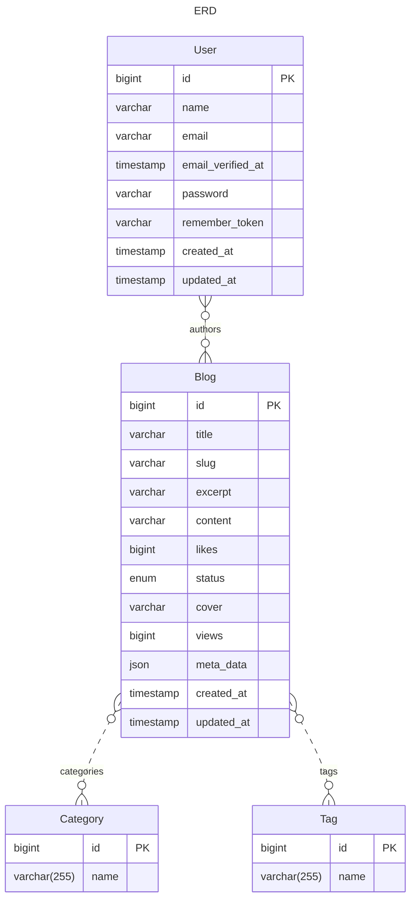

# Database Schema – Blog System

## هدف
ذخیره و مدیریت پست‌های بلاگ با دسته‌بندی‌ها، تگ‌ها و نسبت نویسندگان.

## جداول و ستون‌ها (حداقل لازم)
### blogs
- id (PK, bigint)
- title (varchar 255, not null)
- slug (varchar 255, unique, indexed)
- excerpt (text, nullable)
- content (longtext)
- status (enum: draft|published|archived)  -- پیشنهاد
- published_at (datetime, nullable)
- author_id (FK -> users.id)               -- اگر داری
- created_at, updated_at, deleted_at?      -- soft delete پیشنهادی

### categories
- id (PK)
- name (varchar 120, unique)
- slug (varchar 120, unique, indexed)
- description (text, nullable)
- created_at, updated_at

### tags
- id (PK)
- name (varchar 120, unique)
- slug (varchar 120, unique, indexed)
- created_at, updated_at

### blogs_categories (Pivot)
- blog_id (FK -> blogs.id, on delete cascade, indexed)
- category_id (FK -> categories.id, on delete cascade, indexed)
- PRIMARY KEY (blog_id, category_id)

### blogs_tags (Pivot)
- blog_id (FK -> blogs.id, on delete cascade, indexed)
- tag_id (FK -> tags.id, on delete cascade, indexed)
- PRIMARY KEY (blog_id, tag_id)

### blogs_users (Pivot)  -- اگر همکاری چند نویسنده داری
- blog_id (FK -> blogs.id, on delete cascade, indexed)
- user_id (FK -> users.id, on delete cascade, indexed)
- role (enum: owner|coauthor|editor)  -- اختیاری
- PRIMARY KEY (blog_id, user_id)

## نام‌گذاری و قیود
- تمام `slug`ها UNIQUE.
- Pivotها Composite PK داشته باشند تا رکورد تکراری وارد نشود.
- ایندکس‌ها: slugها، published_at (برای مرتب‌سازی)، status.
- پیشنهاد: Soft Delete روی blogs برای بازیابی سریع.

## روابط (Laravel)
- Blog:
  - belongsTo User (author) *(اختیاری)*
  - belongsToMany Category through blogs_categories
  - belongsToMany Tag through blogs_tags
  - belongsToMany User (coauthors) through blogs_users *(اختیاری)*
- Category: belongsToMany Blog
- Tag: belongsToMany Blog

## ERD (مرمید)

